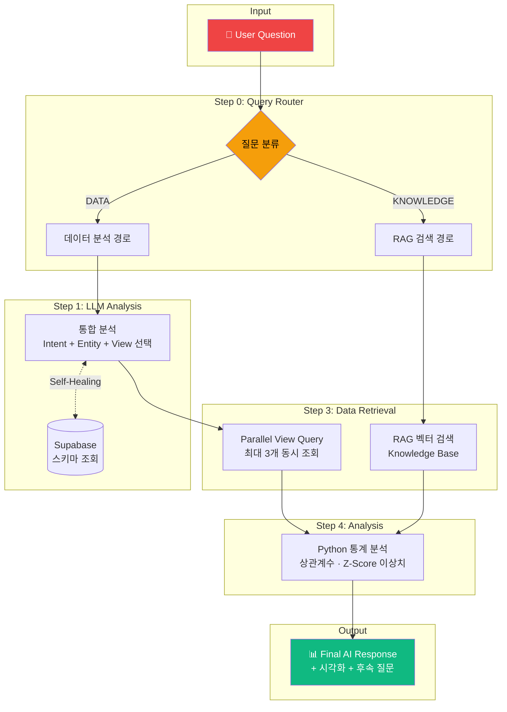

# YouTube Analytics Dashboard

> YouTube 트렌딩 데이터를 수집하고 AI 기반 분석을 제공하는 데이터 파이프라인

---

## 아키텍처

```
┌─────────────────────────────────────────────────────────────────────────────────┐
│                          YouTube Analytics Pipeline                              │
├─────────────────────────────────────────────────────────────────────────────────┤
│                                                                                  │
│   ┌─────────────┐     ┌─────────────┐     ┌─────────────┐     ┌─────────────┐   │
│   │   GitHub    │────▶│ Cloud Build │────▶│   GCR       │────▶│  Cloud Run  │   │
│   │   (Push)    │     │  (트리거)    │     │  (이미지)   │     │    Job      │   │
│   └─────────────┘     └─────────────┘     └─────────────┘     └──────┬──────┘   │
│                                                                      │          │
│   ┌──────────────────────────────────────────────────────────────────┘          │
│   │                                                                              │
│   │   ┌─────────────────────────────────────────────────────────────────────┐   │
│   │   │                    Cloud Scheduler (스케줄러)                        │   │
│   │   ├─────────────┬─────────────┬─────────────┬─────────────┐             │   │
│   │   │  videos     │  comments   │ categories  │  channels   │             │   │
│   │   │  (매시간)    │  (매시간)    │  (주1회)     │  (일1회)     │             │   │
│   │   │  0 * * * *  │  5 * * * *  │  0 0 * * 0  │  0 1 * * *  │             │   │
│   │   └──────┬──────┴──────┬──────┴──────┬──────┴──────┬──────┘             │   │
│   │          │             │             │             │                     │   │
│   │          ▼             ▼             ▼             ▼                     │   │
│   │   ┌─────────────────────────────────────────────────────────────────┐   │   │
│   │   │                     YouTube Data API v3                          │   │   │
│   │   │  videos.list │ commentThreads.list │ videoCategories │ channels  │   │   │
│   │   └─────────────────────────────────────────────────────────────────┘   │   │
│   │                                    │                                     │   │
│   └────────────────────────────────────┼─────────────────────────────────────┘   │
│                                        ▼                                         │
│   ┌─────────────────────────────────────────────────────────────────────────┐   │
│   │                         GCS Bucket (Raw 레이어)                          │   │
│   │                                                                          │   │
│   │   gs://plosind-youtube-raw-data/                                        │   │
│   │   └── raw/youtube/                                                       │   │
│   │       ├── videos_list/region=KR/date=YYYY-MM-DD/hour=HH/                │   │
│   │       ├── comment_threads/region=KR/date=YYYY-MM-DD/hour=HH/video_id=/  │   │
│   │       ├── video_categories/region=KR/date=YYYY-MM-DD/                   │   │
│   │       └── channels/date=YYYY-MM-DD/                                     │   │
│   │                                                                          │   │
│   └─────────────────────────────────────────────────────────────────────────┘   │
│                                        │                                         │
│                                        ▼                                         │
│   ┌─────────────────────────────────────────────────────────────────────────┐   │
│   │                      Transform 레이어 (Python/DBT)                       │   │
│   │                                                                          │   │
│   │   Raw JSON ──▶ Clean 테이블 ──▶ Mart 뷰                                 │   │
│   │                                                                          │   │
│   └─────────────────────────────────────────────────────────────────────────┘   │
│                                        │                                         │
│                                        ▼                                         │
│   ┌─────────────────────────────────────────────────────────────────────────┐   │
│   │                         Supabase (PostgreSQL)                            │   │
│   │                                                                          │   │
│   │   ┌─────────────┐    ┌─────────────┐    ┌─────────────┐                 │   │
│   │   │   Clean     │    │    Mart     │    │    Role     │                 │   │
│   │   │   테이블     │───▶│     뷰      │───▶│  (AI 전용)   │                 │   │
│   │   └─────────────┘    └─────────────┘    └──────┬──────┘                 │   │
│   │                                                │                         │   │
│   └────────────────────────────────────────────────┼─────────────────────────┘   │
│                                                    │                             │
│                                                    ▼                             │
│   ┌─────────────────────────────────────────────────────────────────────────┐   │
│   │                          애플리케이션 레이어                              │   │
│   │                                                                          │   │
│   │   ┌─────────────┐         ┌─────────────┐         ┌─────────────┐       │   │
│   │   │   Ollama    │◀───────▶│  Streamlit  │◀───────▶│   사용자     │       │   │
│   │   │  (LLM AI)   │         │ (대시보드)   │         │  (브라우저)  │       │   │
│   │   └─────────────┘         └─────────────┘         └─────────────┘       │   │
│   │                                                                          │   │
│   └─────────────────────────────────────────────────────────────────────────┘   │
│                                                                                  │
└──────────────────────────────────────────────────────────────────────────────────┘
```

---

## 기술 스택

| 레이어 | 기술 | 설명 |
|--------|------|------|
| **스케줄링** | Cloud Scheduler | Cron 기반 작업 스케줄링 |
| **컴퓨팅** | Cloud Run Job | 서버리스 컨테이너 실행 |
| **스토리지** | Google Cloud Storage | Raw 데이터 저장소 |
| **데이터베이스** | Supabase (PostgreSQL) | Clean/Mart 테이블 저장 |
| **변환** | Python / DBT | 데이터 정제 및 집계 |
| **AI** | Ollama | 로컬 LLM 기반 분석 |
| **Frontend** | Next.js + TypeScript | 대시보드 UI |
| **Backend** | FastAPI (Python) | API 서버 + AI 연동 |
| **CI/CD** | Cloud Build + GitHub | 자동 빌드 및 배포 |

---

## 프로젝트 구조

```
DE_pro/
├── youtube_collector/          # 데이터 수집기
│   ├── src/
│   │   ├── clients/           # API 클라이언트
│   │   │   └── youtube.py     # YouTube API 호출
│   │   ├── collectors/        # 수집기 클래스
│   │   │   ├── base.py        # 베이스 클래스
│   │   │   ├── videos.py      # 트렌딩 영상 수집
│   │   │   ├── comments.py    # 댓글 수집
│   │   │   ├── categories.py  # 카테고리 수집
│   │   │   └── channels.py    # 채널 정보 수집
│   │   ├── storage/           # 스토리지 클래스
│   │   │   └── gcs.py         # GCS 업로드
│   │   ├── config.py          # 환경변수 설정
│   │   └── main.py            # CLI 진입점
│   ├── Dockerfile
│   ├── requirements.txt
│   └── cloudbuild.yaml
├── .env                        # 환경변수 (Git 제외)
└── README.md
```

---

## 데이터 흐름

```
┌──────────────────────────────────────────────────────────────────────────┐
│                            데이터 수집 작업                               │
├──────────────────────────────────────────────────────────────────────────┤
│                                                                          │
│   Job 1: videos        Job 2: comments      Job 3: categories            │
│   ┌──────────────┐     ┌──────────────┐     ┌──────────────┐            │
│   │ 트렌딩 50개   │     │ 상위 5개 영상 │     │ 카테고리 매핑 │            │
│   │ 영상/시간당   │     │ 댓글 100개   │     │ 주간 동기화   │            │
│   └──────┬───────┘     └──────┬───────┘     └──────┬───────┘            │
│          │                    │                    │                     │
│          ▼                    ▼                    ▼                     │
│   ┌─────────────────────────────────────────────────────────────────┐   │
│   │                    GCS: Raw 레이어 (JSON.gz)                     │   │
│   │                                                                  │   │
│   │  • Hive 스타일 파티셔닝 (region/date/hour)                       │   │
│   │  • 불변, 추가 전용 (append-only)                                 │   │
│   │  • 메타데이터 포함 (_metadata.json)                              │   │
│   └─────────────────────────────────────────────────────────────────┘   │
│                                                                          │
└──────────────────────────────────────────────────────────────────────────┘
                                    │
                                    ▼
┌──────────────────────────────────────────────────────────────────────────┐
│                               변환 단계                                   │
├──────────────────────────────────────────────────────────────────────────┤
│                                                                          │
│   Raw (GCS)              Clean (Supabase)         Mart (Supabase)       │
│   ┌──────────┐          ┌──────────────┐        ┌──────────────┐        │
│   │ JSON.gz  │ ──────▶  │ videos       │ ─────▶ │ trending_    │        │
│   │ 파일     │          │ comments     │        │ analysis     │        │
│   │          │          │ categories   │        │ channel_stats│        │
│   └──────────┘          └──────────────┘        └──────────────┘        │
│                                                                          │
│   • 역정규화              • 중복 제거             • 집계 데이터           │
│   • 스키마 검증           • 타입 변환             • 메트릭 계산           │
│                          • PK 제약조건           • AI용 뷰               │
│                                                                          │
└──────────────────────────────────────────────────────────────────────────┘
```

---

## Raw 데이터 보관 정책

| 데이터 유형 | 보관 기간 | 이유 |
|-------------|-----------|------|
| `videos_list` | 90일 | 트렌드 추세/계절성 분석용 |
| `comment_threads` | 14일 | 용량이 큼, Clean에서 요약만 저장 |
| `video_categories` | 365일 | 거의 변경 없음, 보관 부담 없음 |
| `channels` | 180일 | 채널 성장 분석용 |

---

## 사용법

### 로컬 개발

```bash
# 환경변수 설정
cp .env.example .env

# 의존성 설치
cd youtube_collector
pip install -r requirements.txt

# 수집 실행
python -m src.main --job=videos      # 트렌딩 영상
python -m src.main --job=comments    # 댓글
python -m src.main --job=categories  # 카테고리
python -m src.main --job=channels    # 채널 정보
```

### Docker

```bash
# 이미지 빌드
docker build -t youtube-collector ./youtube_collector

# 컨테이너 실행
docker run --env-file .env youtube-collector --job=videos
```

### Cloud Run Job 배포

```bash
# Job 생성
gcloud run jobs create youtube-videos \
  --image gcr.io/deproject-482905/youtube-collector \
  --args="--job=videos" \
  --region=asia-northeast3

# 스케줄러 연결
gcloud scheduler jobs create http youtube-videos-scheduler \
  --schedule="0 * * * *" \
  --uri="https://asia-northeast3-run.googleapis.com/..." \
  --http-method=POST
```

---

## 환경변수

```env
# YouTube API
YOUTUBE_API_KEY=your_api_key

# GCP 설정
GCP_PROJECT_ID=
GCS_BUCKET_NAME=

# 수집 설정
YOUTUBE_REGION_CODE=KR                          # 수집 대상 지역
YOUTUBE_MAX_RESULTS=50                          # 트렌딩 영상 수
YOUTUBE_COMMENT_TARGET_VIDEOS_PER_SNAPSHOT=5    # 댓글 수집 대상 영상 수
YOUTUBE_COMMENT_MAX_PAGES_PER_VIDEO=2           # 영상당 댓글 페이지 수
```

---

## 웹 애플리케이션 아키텍처

```
┌──────────────────────────────────────────────────────────────────────────────┐
│                           Web Application Layer                               │
├──────────────────────────────────────────────────────────────────────────────┤
│                                                                               │
│   ┌─────────────────────────────────────────────────────────────────────┐    │
│   │                        Frontend (Next.js)                            │    │
│   │                                                                      │    │
│   │   ┌─────────────┐   ┌─────────────┐   ┌─────────────┐              │    │
│   │   │  Dashboard  │   │   AI Chat   │   │  Analytics  │              │    │
│   │   │   (차트)     │   │   (채팅)    │   │  (리포트)   │              │    │
│   │   └──────┬──────┘   └──────┬──────┘   └──────┬──────┘              │    │
│   │          │                 │                 │                      │    │
│   │   ┌──────┴─────────────────┴─────────────────┴──────┐              │    │
│   │   │              shadcn/ui + Tailwind CSS            │              │    │
│   │   │                  Recharts (차트)                  │              │    │
│   │   └─────────────────────────┬────────────────────────┘              │    │
│   │                             │                                        │    │
│   └─────────────────────────────┼────────────────────────────────────────┘    │
│                                 │ REST API                                    │
│                                 ▼                                             │
│   ┌─────────────────────────────────────────────────────────────────────┐    │
│   │                        Backend (FastAPI)                             │    │
│   │                                                                      │    │
│   │   ┌─────────────┐   ┌─────────────┐   ┌─────────────┐              │    │
│   │   │  Data API   │   │  AI Service │   │  Insights   │              │    │
│   │   │  (CRUD)     │   │  (Ollama)   │   │  Generator  │              │    │
│   │   └──────┬──────┘   └──────┬──────┘   └──────┬──────┘              │    │
│   │          │                 │                 │                      │    │
│   └──────────┼─────────────────┼─────────────────┼──────────────────────┘    │
│              │                 │                 │                           │
│              ▼                 ▼                 │                           │
│   ┌─────────────────┐   ┌─────────────┐         │                           │
│   │    Supabase     │   │   Ollama    │         │                           │
│   │   (PostgreSQL)  │   │ (Local LLM) │◀────────┘                           │
│   │                 │   │             │                                      │
│   │  ┌───────────┐  │   │  llama3.2   │                                      │
│   │  │ AI Views  │  │   │  gemma2     │                                      │
│   │  │ (7개)     │  │   │  etc...     │                                      │
│   │  └───────────┘  │   └─────────────┘                                      │
│   └─────────────────┘                                                        │
│                                                                               │
└──────────────────────────────────────────────────────────────────────────────┘

---

## AI 챗봇 아키텍처




### AI 분석 파이프라인 설명

| 단계 | 구현 내용 |
|------|----------|
| **Query Router** | 질문 유형(데이터 분석 vs 일반 지식)에 따라 처리 경로 분기 |
| **LLM Analysis** | 단일 LLM 호출로 필요한 View 선택 (DB 스키마를 프롬프트에 포함) |
| **Parallel Query** | 선택된 View 최대 3개를 `asyncio.gather()`로 동시 조회 |
| **통계 분석** | Pandas로 피어슨 상관계수 계산, Z-Score 기반 이상치 탐지 수행 |
| **응답 생성** | 분석 결과를 자연어로 변환, 후속 질문 제안 |

### 웹 기술 스택

| 레이어 | 기술 | 설명 |
|--------|------|------|
| **Frontend** | Next.js 14 + TypeScript | App Router, SSR 지원 |
| **UI 컴포넌트** | shadcn/ui + Tailwind CSS | 모던한 UI, 빠른 개발 |
| **차트** | Recharts | React 친화적 데이터 시각화 |
| **Backend** | FastAPI (Python) | 비동기 API, Ollama 연동 |
| **AI** | Ollama | 로컬 LLM (llama3.2, gemma2 등) |
| **Database** | Supabase | PostgreSQL + AI 전용 View |

### 프론트엔드 페이지 구성

| 페이지 | 경로 | 설명 |
|--------|------|------|
| Overview | `/` | KPI 카드, TOP 10, 카테고리 분포 |
| Trending | `/trending` | TOP 50 전체 리스트, 필터/정렬 |
| Channels | `/channels` | 채널 분석, 규모별 분포 |
| Categories | `/categories` | 카테고리별 상세 분석 |
| AI Chat | `/chat` | 자연어 질의 챗봇 |

### AI 전용 View (Supabase)

| View | 용도 |
|------|------|
| `ai_current_trending` | 현재 트렌딩 TOP 50 |
| `ai_category_stats` | 카테고리별 통계 |
| `ai_channel_stats` | 채널별 트렌딩 통계 |
| `ai_top_growing` | 급성장 비디오 |
| `ai_video_history` | 비디오 순위/조회수 이력 |
| `ai_popular_comments` | 인기 댓글 |
| `ai_daily_summary` | 일별 요약 통계 |

### 웹 프로젝트 구조

```
web/
├── frontend/                    # Next.js 앱
│   ├── app/                     # App Router
│   │   ├── page.tsx             # Overview 페이지
│   │   ├── trending/
│   │   ├── channels/
│   │   ├── categories/
│   │   └── chat/
│   ├── components/              # UI 컴포넌트
│   │   ├── ui/                  # shadcn/ui
│   │   ├── charts/              # 차트 컴포넌트
│   │   └── chat/                # 챗봇 컴포넌트
│   ├── lib/                     # 유틸리티
│   └── package.json
│
└── backend/                     # FastAPI 앱
    ├── app/
    │   ├── main.py              # 엔트리포인트
    │   ├── routers/             # API 라우터
    │   │   ├── trending.py
    │   │   ├── channels.py
    │   │   └── chat.py
    │   ├── services/            # 비즈니스 로직
    │   │   ├── supabase.py
    │   │   └── ollama.py
    │   └── models/              # Pydantic 모델
    ├── requirements.txt
    └── .env
```

---

## 데이터 품질 관리 (Data Quality)

### 중복 처리 방지

```sql
-- processed_files 테이블로 파일별 처리 상태 추적
SELECT file_path, status, records_count, processed_at
FROM processed_files
WHERE status = 'success';

-- fact_comments: 복합키로 동일 댓글의 시점별 트렌드 추적
PRIMARY KEY (comment_id, collected_at)
```

### 에러 핸들링 및 재처리

| 상황 | 처리 방식 |
|------|----------|
| API 실패 | 최대 3회 재시도 후 `status='error'` 기록 |
| 중복 파일 | `processed_files` 조회로 스킵 여부 결정 |
| 스키마 불일치 | Cloud Function 로그 기록, 수동 확인 |
| 재처리 필요 시 | `trigger_missing.py`로 누락 파일 자동 탐지 및 재실행 |

---

## 설계 의도 (Why This Architecture?)

> **"현재 트래픽은 작지만, 프로덕션급 데이터 파이프라인 설계 역량을 증명하기 위해 확장 가능한 아키텍처를 적용했습니다."**

| 선택 | 이유 |
|------|------|
| Cloud Run Job | 서버리스로 비용 최적화, 매시간 실행으로 유휴 비용 0원 |
| GCS Raw 레이어 | 불변 저장소로 데이터 리니지 추적, 재처리 가능 |
| Supabase | 무료 Tier로 PostgreSQL + API 자동 생성, AI View 지원 |
| Event-driven Transform | GCS 업로드 이벤트로 Cloud Function 자동 트리거, 배치 의존성 제거 |

이 구조는 **일일 100만 건 이상의 데이터 처리**로 확장 가능하도록 설계되었습니다.

---

## 한계점 및 향후 계획 (Limitations & Future Work)

| 항목 | 현재 상태 | 해결 방안 |
|------|----------|----------|
| **LLM Inference** | 로컬 Ollama 사용 (GPU 필요) | 프로덕션 시 OpenAI API 또는 Vertex AI 전환 |
| **실시간 처리** | 시간 단위 배치 수집 | Pub/Sub + Dataflow로 스트리밍 전환 가능 |
| **비용** | GCP 무료 Tier 최적화 | 트래픽 증가 시 Cloud Run 오토스케일링 설정 |
| **모니터링** | Cloud Logging 수동 확인 | Grafana + Prometheus 대시보드 구축 예정 |

---

## 개발 과정에서의 문제 해결 (Troubleshooting & Lessons Learned)

### 1. Transform 레이어 중복 키 에러

**문제**: `fact_comments` 테이블에 동일 댓글이 다른 시간에 수집될 때 `duplicate key value violates unique constraint` 에러 발생

**원인**: 기본키가 `comment_id` 단독으로 설정되어 있어, 트렌드 추적을 위한 시점별 데이터 저장 불가

**해결**:
```sql
ALTER TABLE fact_comments DROP CONSTRAINT fact_comments_pkey;
ALTER TABLE fact_comments ADD PRIMARY KEY (comment_id, collected_at);
```

**교훈**: 트렌드 분석이 목적인 테이블은 **시간 컬럼을 복합키**에 포함해야 함

---

### 2. 테이블/컬럼명 불일치로 인한 Cloud Function 실패

**문제**: Transform Cloud Function이 `etl_processed_files` 테이블을 찾지 못해 205건의 데이터 처리 실패

**원인**: 코드에서 사용한 테이블명(`etl_processed_files`)과 실제 Supabase 테이블명(`processed_files`)이 불일치

**해결**:
```python
# Before
client.table("etl_processed_files").select("blob_path")...

# After
client.table("processed_files").select("file_path")...
```

**교훈**: 스키마 변경 시 **모든 참조 코드를 동기화**해야 하며, CI/CD에 스키마 검증 단계 추가 필요

---

### 3. 로컬 환경에서 GCS 접근 실패 (404 Project Not Found)

**문제**: `trigger_missing.py` 실행 시 `The requested project was not found` 에러

**원인**: Python `google-cloud-storage` 라이브러리가 Application Default Credentials를 찾지 못함

**해결**:
```bash
# ADC 설정
gcloud auth application-default login

# 스크립트에서 프로젝트 ID 명시
storage_client = storage.Client(project="deproject-482905")
```

**교훈**: 로컬 개발 환경과 Cloud 환경의 **인증 방식 차이**를 이해하고, 스크립트에 fallback 로직 구현

---

### 4. 실패 데이터 재처리 자동화

**문제**: 에러가 발생한 파일들을 수동으로 찾아서 재처리해야 하는 번거로움

**해결**: `trigger_missing.py` 스크립트 개발
- Supabase `processed_files`와 GCS 파일 목록 비교
- 누락된 파일만 자동 탐지
- GCS `blob.rewrite(blob)`로 Cloud Function 트리거 재발생

```python
# GCS에 있지만 Supabase에 기록 없는 파일 탐지
if blob.name not in processed_paths:
    blob.rewrite(blob)  # Cloud Function 트리거
```

**교훈**: **멱등성(Idempotency)**과 **재처리 가능성**을 고려한 파이프라인 설계 필수

---

### 5. Transform 레이어 모듈화

**Before**: 단일 `main.py`에 모든 변환 로직 (400줄+)

**After**: 
```
transform/
├── app/
│   ├── core/
│   │   ├── utils.py      # 경로 파싱, 유틸리티
│   │   └── database.py   # DB 작업 (insert, upsert)
│   └── transformers/
│       ├── videos.py     # 영상 변환
│       ├── comments.py   # 댓글 변환
│       ├── channels.py   # 채널 변환
│       └── categories.py # 카테고리 변환
└── main.py               # Cloud Function 진입점
```

**교훈**: 데이터 유형별로 **책임 분리**하면 테스트, 디버깅, 확장이 용이해짐

---
