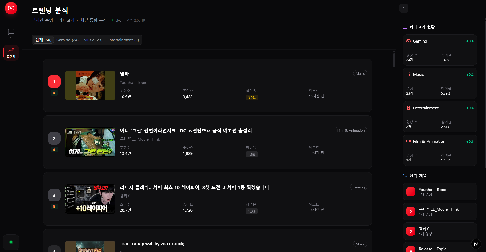

# DE-pipeline

[](#)
[](#)
[](#)
[](#)

YouTube 데이터를 수집·정제·적재한 뒤 분석 API, 대시보드, 질의형 챗봇까지 연결한 end-to-end 데이터 파이프라인 프로젝트입니다.



## What it demonstrates

- Raw -> Clean -> Mart -> API -> Dashboard 흐름
- YouTube API 기반 videos, comments, categories, channels 수집
- GCS Raw 적재, Supabase/PostgreSQL 정제
- FastAPI 분석 API
- Next.js 대시보드와 챗봇

```text
YouTube Data API -> GCS Raw -> Transform -> Supabase/PostgreSQL Clean & Mart
                                                  -> FastAPI -> Next.js dashboard / chatbot
```

## Contributions

- 데이터 수집 파이프라인 설계
- GCS 적재 구조와 메타데이터 규칙 정리
- Transform 레이어 구현
- FastAPI 기반 분석 API 구현
- Next.js 대시보드와 챗봇 흐름 연결

## Repository map

- `youtube_collector/`: 수집기
- `transform/`: 정제 및 적재
- `web/backend/`: 분석 API
- `web/frontend/`: 대시보드와 채팅 UI

## Prerequisites

- Python and Node.js
- YouTube Data API key
- Google Cloud credentials and a GCS bucket
- Supabase project credentials for transform/API paths

Copy [`.env.example`](.env.example) to a local `.env` and set secrets only in your local environment. The collector reads values such as `YOUTUBE_API_KEY`, `GOOGLE_APPLICATION_CREDENTIALS`, `GCP_PROJECT_ID`, and `GCS_BUCKET_NAME`; transform/API paths also use `SUPABASE_URL` and a service key. Do not commit them.

## Run locally

### Collector

```powershell
cd youtube_collector
pip install -r requirements.txt
python -m src.main --job videos
```

### Backend

```powershell
cd web\backend
pip install -r requirements.txt
uvicorn app.main:app --reload
```

### Frontend

```powershell
cd web\frontend
npm install
npm run dev
```

## Notes

- The project is a portfolio pipeline, so running the complete cloud path requires your own YouTube, GCP, and Supabase configuration.
- The dashboard can use `NEXT_PUBLIC_API_URL` to point at a non-default API address.
