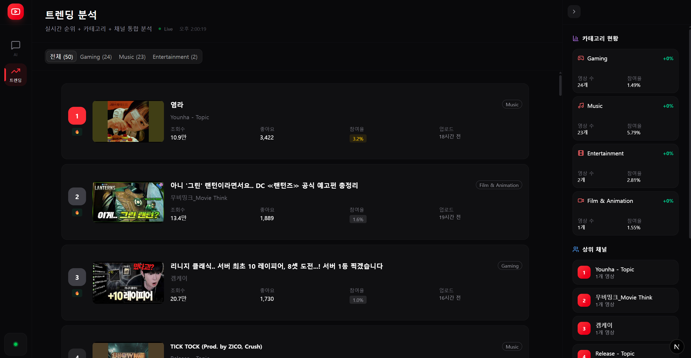

# DE-pipeline

[](#)
[](#)
[](#)
[](#)

> **기간:** 2026.01–2026.02 · **형태:** 개인 프로젝트 · **범위:** 데이터 수집부터 ELT, 분석 API, 대시보드와 챗봇 연결까지 전체 구현

YouTube 데이터를 수집·정제·적재한 뒤 분석 API, 대시보드, 질의형 챗봇까지 연결한 end-to-end 데이터 파이프라인 프로젝트입니다.



## 문제

수집 데이터, 시각화, 질의응답이 각각 분리되어 있으면 데이터를 분석하고 실제 결과로 사용하는 흐름이 끊깁니다. 이 프로젝트는 원천 데이터 수집부터 분석·질의까지 하나의 재현 가능한 경로로 연결하는 것을 목표로 했습니다.

## 만든 것

```text
YouTube Data API
      ↓
GCS Raw
      ↓
Transform
      ↓
Supabase / PostgreSQL Clean & Mart
      ↓
FastAPI 분석 API
      ├─ Next.js 대시보드
      └─ 질의형 챗봇
```

- YouTube API 기반 videos, comments, categories, channels 수집
- GCS Raw 적재와 메타데이터 관리
- Transform 레이어에서 정제·적재
- Supabase/PostgreSQL 기반 Clean·Mart 데이터 구조
- FastAPI 분석 API
- Next.js 대시보드와 RAG 기반 챗봇 흐름

## 직접 구현한 범위

- 데이터 수집 파이프라인 설계
- GCS Raw 적재 구조와 메타데이터 규칙 정리
- Transform 레이어 구현
- FastAPI 기반 분석 API 구현
- Next.js 대시보드와 챗봇 흐름 연결

## 기술적으로 확인한 것

- Raw·정제·분석 계층을 분리해 데이터 흐름을 추적할 수 있도록 구성
- API와 화면을 분리해 같은 분석 결과를 대시보드와 챗봇에서 재사용
- 클라우드 저장소·데이터베이스·API·프런트엔드가 이어지는 전체 경로를 하나의 프로젝트로 검증

## 알려진 한계와 다음 개선

- **스케줄링·오케스트레이션**: 수집기는 Cloud Run job, 정제는 GCS 업로드 트리거 Cloud Function으로 동작하지만, 실행 스케줄(Cloud Scheduler 등)과 작업 간 의존성은 저장소에 코드로 정의되어 있지 않습니다. → Terraform으로 스케줄을 코드화하거나 Airflow/Dagster로 의존성을 명시할 예정입니다.
- **멱등성**: `processed_files`로 처리한 파일을 건너뛰지만, 확인과 기록이 원자적이지 않고 팩트 테이블은 insert 전용(`transform/app/transformers/videos.py`, `comments.py`)이라 같은 파일을 다시 처리하면 중복 행이 생깁니다. → `(video_id, snapshot_at)` 같은 자연키로 upsert하고, 재처리·backfill 명령을 정리할 예정입니다.
- **스키마 관리**: 팩트 테이블과 분석용 `ai_*` 뷰의 DDL이 저장소에 없습니다(현재 SQL 파일은 `web/backend/scripts/setup_pgvector.sql`뿐). → 마이그레이션 또는 dbt 모델로 옮기고 unique / not_null / freshness 테스트를 붙일 예정입니다.
- **데이터 품질 검사**가 없습니다.
- **분석 API**: Supabase 서비스 키를 그대로 사용하고, 오류 응답에 예외 메시지를 노출하며(`detail=str(e)`), 기본 설정이 `debug=True`입니다. 챗봇 엔드포인트에 인증과 rate limit이 없습니다.
- **테스트**: 테스트는 챗봇 쪽(`web/backend/tests`)에만 있고, 현재 코드와 맞지 않아 통과하는 테스트가 없습니다. `test_step5.py`는 이름이 바뀐 함수를, `test_chat_service.py`는 구현되지 않은 `LRUSessionHistory`를 import합니다. `test_chat_router.py`의 보안 테스트 3개는 챗봇이 내부 오류 메시지를 응답에 그대로 노출해서 실패합니다. 수집기와 정제 로직에는 테스트가 없습니다. → 오류 메시지 노출을 먼저 고치고, 테스트를 현재 코드에 맞춘 뒤 CI를 붙일 예정입니다. (`pip install -r web/backend/requirements-dev.txt` 후 `web/backend`에서 `pytest`로 실행)

## Repository map

- `youtube_collector/`: 수집기
- `transform/`: 정제 및 적재
- `web/backend/`: 분석 API
- `web/frontend/`: 대시보드와 채팅 UI

## 실행 조건

- Python and Node.js
- YouTube Data API key
- Google Cloud credentials and a GCS bucket
- Supabase project credentials for transform/API paths

Copy [`.env.example`](.env.example) to a local `.env` and set secrets only in your local environment. The collector reads values such as `YOUTUBE_API_KEY`, `GOOGLE_APPLICATION_CREDENTIALS`, `GCP_PROJECT_ID`, and `GCS_BUCKET_NAME`; transform/API paths also use `SUPABASE_URL` and a service key. Do not commit them.

## Run locally

### Collector

```powershell
cd youtube_collector
pip install -r requirements.txt
python -m src.main --job videos
```

### Backend

```powershell
cd web\backend
pip install -r requirements.txt
uvicorn app.main:app --reload
```

### Frontend

```powershell
cd web\frontend
npm install
npm run dev
```

## 한계

- 포트폴리오용 파이프라인이므로 전체 cloud 경로를 실행하려면 각자의 YouTube, GCP, Supabase 설정이 필요합니다.
- 데이터 규모, 처리 시간, 비용 지표는 실행 환경과 수집 범위에 따라 달라지므로 이 저장소에서 고정된 수치로 제시하지 않습니다.
- 운영 배포 전에는 credential 관리, 재시도·중복 처리, 비용·쿼리 최적화를 별도로 검토해야 합니다.
